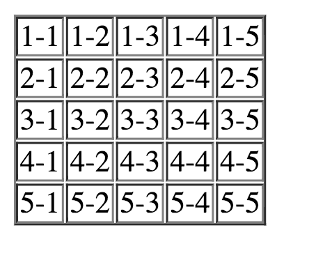
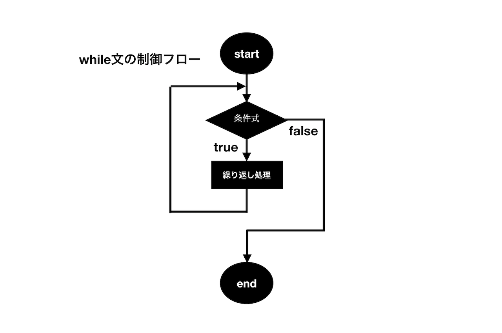

# Lesson 7. ステートメント(文) その2 - for文、while文

## 目的

- ループの概念を理解する。
- for文、while文を利用してプログラムを書けるようになる。

## ループ(Loop)とは

プログラミングでは、何らかの条件に応じて繰り返し処理を行うことがよくあります。例えばですが、Webサイトに登録している全てのユーザーに対してメールを送りたいというような場合もあるでしょう。全てのユーザーといってもメールの受付を拒否しているユーザーもいるので条件を設定してメール受付拒否をしてないユーザーという条件で繰り返しメールを送らなければなりません。

こうしたときに便利なのがループ(繰り返し処理)です。このレッスンでは**_for文_**と**_while文_**を使ったループの書き方について学んでいきましょう。

## for文

**_for文_**はプログラミングでは非常に利用頻度の高い制御文です。繰り返し処理の中で特にブロック内の処理を繰り返す回数があらかじめ決まっている場合に有効です。

## for文の構文

まずfor文の書き方を見て見ましょう。for文のシンタックス(構文)は次の通りになります。

```js

for (初期化式; 条件式; 変化式) {
  文；
  文;
  文;
}
```

`for`の後に1つスペースがあり、またブロック「{}」の開始前にも1つスペースがあることに注意してください。これらのスペースはなくてもJavascriptは同じ用に解釈しますが、可読性を高めるためスペースを一貫して空けるようにしましょう。

ブロック「{}」で囲まれた部分の文は**_繰り返し処理_**と呼ばれます。繰り返しの処理文が単一の時は以下のようにブロックなしで記述することもできます。

```js
for (初期化式; 条件式; 変化式) 文;
```

以下の例を使って**_for文_**の「()」の中の式の意味について解説します。

```js
for (let i = 0; i <= 2 ; i++) {
  繰り返し処理の文;
}
```

繰り返し処理を制御するのに使われる**変数i**は**_カウンタ変数_**と呼ばれます。**_カウンタ変数_**は慣習として**アルファベットのi**がよく使われます。また**_for文_**の中に更に*+_for文_**を書く場合には一般的に*+アルファベットのj**を使います。

全体の処理の流れを見ていくと

 1. 初期化式`let i = 0`が実行される
 2. 条件式`i <= 2`が評価され、真なら繰り返し処理のプロセスに進み、偽なら繰り返し処理を行わずfor文のループを抜ける
 3. ブロック内の**_繰り返し処理の文_**が実行される
 4. 変化式`i++`の処理が実行される
 5. 「2」に戻り、条件式の評価を実行する

`i++`の変化式の処理が**_for文_**の最初の行に書かれているにもかかわらず最後に実行されている点に注意してください。

**_for文_**の制御フローをイメージにすると下の図のようになります。


ここで、次の例をみてください。

```js
for　(let i = 1; i < 3; i++) {
  繰り返し処理の文;
}
```

この場合`let i = 1`のように初期値を1としています。これは先ほどの例と実行結果は変わりません。
もちろんこのようにしても構わないですし、意味がある場合は`i = 1`とする必要があるのですが、通常プログラミングではカウンタ変数の値を**初期値0**とすることが好まれます。これはインデックスの番号が0から始まる配列を取り扱う際に都合が良いからです。

- サンプルコード1

以下の例では整数1から10までの総和を求める処理を実行しています。

```js
let sum = 0;

for (let i = 0; i < 10; i++) {
  sum = sum + i;
}

console.log(sum); // 55
```

この場合**_`+=代入演算子_**を使って次のように記述しても同じ結果が得られます。

```js
let sum = 0;

for (let i = 1; i <= 10; i++) {
  sum += i;
}

console.log(sum); // 55
```

- サンプルコード2

次の例では**_if文_**を組み合わせ、**_カウンタ変数_**が偶数の時のみコンソールに出力するようにしています。

```js
let num = 0;

for (let i = 0; i <= 12; i++) {
  if (i % 2 === 0) { // 2で割り切れる場合のみtrue
    console.log(i);
  }
}
```

出力結果:

```javascript
0
2
4
6
8
10
12
```

- サンプルコード3

先ほどの例では**_カウンタ変数_**と整数値を使って条件式の評価を行いましたが、条件式には他で定義した変数を使うこともできます。


```javascript
let arr = ['w','o','r','l','d','!'];
let hello = 'Hello ';

for(let i = 0; i < arr.length; i++) {
  hello = hello + arr[i]; // 繰り返すたびに要素の文字列を追加
}

console.log(hello); // "Hello world!"
```

上の例では配列変数の**lengthプロパティ**を使って配列の要素数を取り出しています。このような方法を取ることで、たとえ要素数が未知の配列であっても繰り返しの処理回数を柔軟に指定することができます。


- サンプルコード4

**_for文_**の中に**_for文_**をネストすることができます。この仕組みをうまく使うことで、例えば表の作成を容易に行うことができます。

```js
document.write('<table border="1">');

// カウンタ変数iの繰り返し処理
for (let i = 1; i <= 5; i++) {
   document.write('<tr>');
   //カウンタ変数jの繰り返し処理
   for (let j = 1; j <= 5; j++) {
     document.write(`<td>${i}-${j}</td>`);
   }
   document.write('</tr>');
}

document.write('</table>');
```

このサンプルコードをChromeのDeveloperToolのconsoleで実行すると、ブラウザで次のような結果が得られます。



また繰り返し処理が複数の**_カウンタ変数_**を含んでおり、それらを同時に変化させる場合は、**_カンマ演算子_**を使って記述することもできます。**_カンマ演算子_**は`let i = 1,j = 1`のようにひとつの式を記述する箇所で同時に複数の式を記述することができます。

```js
for (let i = 1, j = 1; i <= 5; i++, j++) {
  // 繰り返し処理
}
```

## for-in文

**_for-in文_**はオブジェクトの中身を取得して、その個数分だけ繰り返し処理ができます。
構文は次のようになります。

```js
for (変数 in オブジェクト) {
  文;
  文;
  文;
}
```

**_for-in文_**はオブジェクトに含まれるプロパティの個数分だけ繰り返し処理が行われ、そのつど変数の中にはオブジェクトのプロパティが代入されます。全ての繰り返し処理が終わると自動的にループが終了します。
オブジェクトを使った繰り返し処理で、既に学んだような通常の**_for文_**を使っても良いのですが、**_for-in文_**はfor文に比べてカウンタ変数を書く必要がなく記述が簡潔になります。繰り返し処理の中でカウンタ変数を使う必要のない場合などは**_for-in文_**を積極的に使うと良いでしょう。


変数はたとえば`let key`のように明示することもできますが、仮に`key`のように変数名のみを宣言したとしても、暗黙的に`let`で変数宣言されます。

- サンプルコード

次のサンプルコードの結果からもわかるように、変数にはオブジェクトの各値ではなく**プロパティ**が格納されることに注意してください。
```js
let obj = {
  a: 1,
  b: 2,
  c: 3
};

for (let item in obj) {
  console.log( item );
}
```

出力結果:

```
a
b
c
```

オブジェクトの中身の値を取り出したい場合は、`obj[item]`のようにプロパティ名を指定して取り出すことができます。

```js
let obj = {
  a: 1,
  b: 2,
  c: 3
};

for (let item in obj) {
  console.log(obj[item]);
}
```

出力結果:

```javascript
1
2
3
```

## for-of文

**_for-of文_**はES6から追加されました。**_for in文_**がオブジェクトの繰り返し処理に特化していた一方で、**_for-of文_**では**配列**に含まれる要素を変数として取り出し、配列の要素の数だけ繰り返し処理を行うことができるようになります。**_for in文_**と同様、**_カウンタ変数_**をわざわざ定義しなくてもいいのが特徴です。

構文は次のようになります。

```js
for (変数 of 配列) {
  文;
  文;
  文;
}
```

**_for in文_**の時と同じように、変数は変数名のみを宣言したとしても、暗黙的に`let`が付与されて変数宣言されます。

- サンプルコード

以下の例では、繰り返し処理の度に`item`に代入された配列要素を2倍にする処理を行なっています。

```javascript
let array = [10, 20, 30];

for (let item of array) {
  item = item * 2;
  console.log(item);
}
```

出力結果:

```javascript
20
40
60
```

## while文

**_while文_**は**_if文_**のようなループの回数指定のない繰り返し処理に使われます。**_while文_**では、条件式が`true`の時ブロック内の繰り返し処理が実行され、その直後に再び条件式を判定します。そして条件式が`true`である限り、ブロック内の文が実行され続けます。

### while文の構文

**_while文_**の構文は次のようになります。

```js
while (条件式) {
  文；
  文;
  文;
}
```

実行したい文が一つの場合に限り以下のように書くこともできます。

```js
while (条件式) 文;
```

**_while文_**の制御フローをイメージにすると下の図のようになります。




- サンプルコード1

下記の例では、変数iが10以上になるまで繰り返し処理を実行しています。繰り返し処理の中で、変数iの値が**インクリメント**により1ずつ増え、10になった段階で次の条件式を満たさなくなるのでループは終了します。

```js
let i =0;

while (i < 10) {
  console.log(i); // 0から9までを表示
  i++;
}
```

出力結果：

```javascript
0
1
2
3
4
5
6
7
8
9
```

- サンプルコード2

この例では値が1000に達するまで、変数を2倍にする処理を繰り返しています。

```js
let number = 1;

while (number < 1000) {
  number *= 2; // number = number * 2 と同意
  console.log(number);
}
```

出力結果：

```js
2
4
8
16
32
64
128
256
512
1024
```

変数`number`が512となった後、次の条件式も`true`となるので`number`の値は処理文を経て1024になります。そして次の条件式の段階で条件式を満たさなくなるため、そこで繰り返し処理がスキップされます。どのタイミングが最後の繰り返し処理となるのかをしっかりと理解しておきましょう。

## while文のfor文への書き換え

**_while文_**と**_for文_**がお互いに書き換えが可能です。
先ほどのサンプルコード2の例を使って**_for文_**への書き換えを行うと次のようになります。

```js
for(let number = 1;number<1000;){
  number*=2;
  console.log(number);
}
```

上記の**_for文_**に変化式が記述されていないことに注目してください。
実は**_for文_**の()の中身はそれぞれ、省略して書くことができます。つまり`for(;;)`のような書き方もしようと思えばできてしまうのです(ただしこれは次に述べる無限ループになってしまいます)。いずれにせよ、上記の例のように繰り返し処理の最後に実行される変化式は省略して、**_while文_**の記述と同じようにすることで**_while文_**と同様の結果が得られます。ただし、このような書き方は不自然な感じがするので敢えてするものでもなく、やはり**_while文_**を使う方が自然です。繰り返し回数の指定がある場合は**_for文_**、ない場合は**_while文_**を使うと覚えておきましょう。

## 無限ループの有用性と危険性

式が偽(`false`)になることのない場合、これを**_無限ループ_**と言います。サーバなどでは常時運用が期待されるので時としてこういう処理も必要です。ですがその場合でもループの中で休憩する処理を入れるなど配慮が必要になります。いずれにしても意図しないプログラムを書いて無限ループになるのはコンピュータに負荷を与えてしまうので避けなければなりません。


## do-while文

**_do-while文_**は**_while文_**と同様に、条件式が真となる限りループを続けます。**_while文_**との違いは、まず繰り返し処理を先に実行し、条件式の評価がそのあとで行われることです。**_do-while文_**を使うことで条件式が`true`か`false`に関わらず、必ず一回は繰り返し処理を実行することができます。一般的に**_do-while_**を使う頻度は**_for文_**や**_while文_**に比べて少ないようですが、**_while文_**との違い、制御フローの特徴をしっかり理解しておきましょう。


### do-while文の構文

**_do-while文_**の構文は次のようになります。**_while文_**では条件式をブロックの先頭に記述していた一方で、**_do-while文_**では条件式を繰り返し処理のブロックの後に書きます。

```js
do {
  文;
  文;
} while (条件式);
```

以下の例で繰り返し処理が実行されるのは、**_do-while文_**側のみです。**_while文_**は条件を満たさないので処理が実行されることはありません。
```js
let i = 1;

while (i < 1) {
  console.log('while文を実行');
  i++;
}

let j = 1;

do {
  console.log('do-while文を実行');
  j++;
} while (j < 1)

```

出力結果：
```js
"do-while文を実行"
```

## breakとcontinue

### break

**_break_**を使用することで繰り返しの途中でループを抜けることができます。**_break_**を実行するかどうかの判断は**_if文_**を使って制御することができます。
for文を例に**_break_**の処理の流れを見てみましょう。

```js
for (let i = 0; i < 10; i++) {
  処理1;
  if (条件式) break; // trueならばループを抜ける
  処理2;
}
```
この**_for文_**では処理1と処理2の間に**_if文_**を使った記述、`if(条件式) break;`が追加されています。もしこの**_if文_**の条件式が真であれば繰り返し処理の途中であってもループを抜けることになります。つまり処理2はスキップされます。


<!--- サンプルコード ---->

### continue

**_break_**では**_break_**が実行された瞬間にループを抜けました。
一方で**_continue_**は特定の回のループの中で以降の処理をスキップしたいときに使えます。
**_continue_**を実行するかは、**_break_**と同じように**_if文_**を使って決定することができます。
こちらも**_for文_**を例に処理の流れを見てみましょう。

```js
for (let i = 0; i < 10; i++) {
  処理1;
  if (条件式) continue; // trueならば処理2をスキップ
  処理2;
}
```

この**_for文_**では処理1と処理2の間に`if (条件式) continue;`が追加されています。この**_if文_**の条件式が真となり**_continue_**が実行された場合、すぐにカウンタ変数の変化式、つまり**_for文_**の`i++`が実行されます。従ってそれに続く処理2は実行されないまま次回のループ(厳密に言うと**_for文_**の条件式の評価)に移ることになります。


## チャレンジ

- [チャレンジ7](./challenge/README.md)

## 更に学ぼう

### 動画で学ぶ

- [JavaScript入門 - ドットインストール](https://dotinstall.com/lessons/basic_javascript_v2)

### 記事で学ぶ

- [Eloquent JavaScript 3rd Edition](http://eloquentjavascript.net/)
