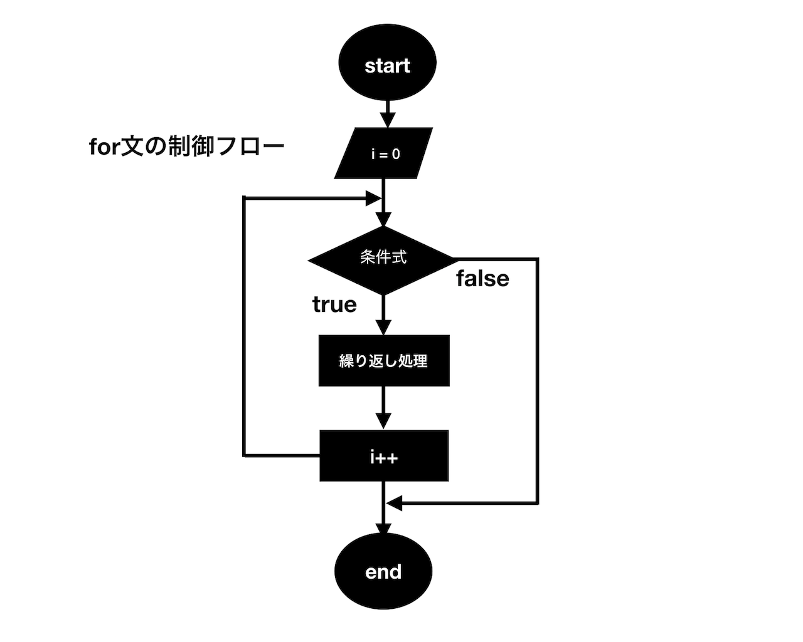
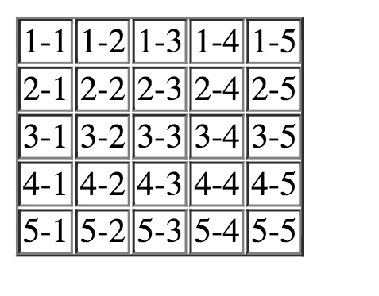

## ループ(Loop)とは

プログラミングでは、何らかの条件に応じて繰り返し処理を行うことがよくあります。例えばですが、Webサイトに登録している全てのユーザーに対してメールを送りたいというような場合もあるでしょう。全てのユーザーといってもメールの受付を拒否しているユーザーもいるので条件を設定してメール受付拒否をしてないユーザーという条件で繰り返しメールを送らなければなりません。

こうしたときに便利なのがループ(繰り返し処理)です。このレッスンでは**_for文_**と**_while文_**を使ったループの書き方について学んでいきましょう。

## for文

**_for文_**はプログラミングでは非常に利用頻度の高い制御文です。繰り返し処理の中で特にブロック内の処理を繰り返す回数があらかじめ決まっている場合に有効です。

## for文の構文

まずfor文の書き方を見て見ましょう。for文のシンタックス(構文)は次の通りになります。

```js

for (初期化式; 条件式; 変化式) {
  文；
  文;
  文;
}
```

`for`の後に1つスペースがあり、またブロック「{}」の開始前にも1つスペースがあることに注意してください。これらのスペースはなくてもJavascriptは同じ用に解釈しますが、可読性を高めるためスペースを一貫して空けるようにしましょう。

ブロック「{}」で囲まれた部分の文は**_繰り返し処理_**と呼ばれます。繰り返しの処理文が単一の時は以下のようにブロックなしで記述することもできます。

```js
for (初期化式; 条件式; 変化式) 文;
```

以下の例を使って**_for文_**の「()」の中の式の意味について解説します。

```js
for (let i = 0; i <= 2 ; i++) {
  繰り返し処理の文;
}
```

繰り返し処理を制御するのに使われる**変数i**は**_カウンタ変数_**と呼ばれます。**_カウンタ変数_**は慣習として**アルファベットのi**がよく使われます。また**_for文_**の中に更に*+_for文_**を書く場合には一般的に*+アルファベットのj**を使います。

全体の処理の流れを見ていくと

 1. 初期化式`let i = 0`が実行される
 2. 条件式`i <= 2`が評価され、真なら繰り返し処理のプロセスに進み、偽なら繰り返し処理を行わずfor文のループを抜ける
 3. ブロック内の**_繰り返し処理の文_**が実行される
 4. 変化式`i++`の処理が実行される
 5. 「2」に戻り、条件式の評価を実行する

`i++`の変化式の処理が**_for文_**の最初の行に書かれているにもかかわらず最後に実行されている点に注意してください。

**_for文_**の制御フローをイメージにすると下の図のようになります。



ここで、次の例をみてください。

```js
for　(let i = 1; i < 3; i++) {
  繰り返し処理の文;
}
```

この場合`let i = 1`のように初期値を1としています。これは先ほどの例と実行結果は変わりません。
もちろんこのようにしても構わないですし、意味がある場合は`i = 1`とする必要があるのですが、通常プログラミングではカウンタ変数の値を**初期値0**とすることが好まれます。これはインデックスの番号が0から始まる配列を取り扱う際に都合が良いからです。

- サンプルコード1

以下の例では整数1から10までの総和を求める処理を実行しています。

```js
let sum = 0;

for (let i = 0; i < 10; i++) {
  sum = sum + i;
}

console.log(sum); // 55
```

この場合**_`+=代入演算子_**を使って次のように記述しても同じ結果が得られます。

```js
let sum = 0;

for (let i = 1; i <= 10; i++) {
  sum += i;
}

console.log(sum); // 55
```

- サンプルコード2

次の例では**_if文_**を組み合わせ、**_カウンタ変数_**が偶数の時のみコンソールに出力するようにしています。

```js
let num = 0;

for (let i = 0; i <= 12; i++) {
  if (i % 2 === 0) { // 2で割り切れる場合のみtrue
    console.log(i);
  }
}
```

出力結果:

```javascript
0
2
4
6
8
10
12
```

- サンプルコード3

先ほどの例では**_カウンタ変数_**と整数値を使って条件式の評価を行いましたが、条件式には他で定義した変数を使うこともできます。


```javascript
let arr = ['w','o','r','l','d','!'];
let hello = 'Hello ';

for(let i = 0; i < arr.length; i++) {
  hello = hello + arr[i]; // 繰り返すたびに要素の文字列を追加
}

console.log(hello); // "Hello world!"
```

上の例では配列変数の**lengthプロパティ**を使って配列の要素数を取り出しています。このような方法を取ることで、たとえ要素数が未知の配列であっても繰り返しの処理回数を柔軟に指定することができます。


- サンプルコード4

**_for文_**の中に**_for文_**をネストすることができます。この仕組みをうまく使うことで、例えば表の作成を容易に行うことができます。

```js
document.write('<table border="1">');

// カウンタ変数iの繰り返し処理
for (let i = 1; i <= 5; i++) {
   document.write('<tr>');
   //カウンタ変数jの繰り返し処理
   for (let j = 1; j <= 5; j++) {
     document.write(`<td>${i}-${j}</td>`);
   }
   document.write('</tr>');
}

document.write('</table>');
```

このサンプルコードをChromeのDeveloperToolのconsoleで実行すると、ブラウザで次のような結果が得られます。



また繰り返し処理が複数の**_カウンタ変数_**を含んでおり、それらを同時に変化させる場合は、**_カンマ演算子_**を使って記述することもできます。**_カンマ演算子_**は`let i = 1,j = 1`のようにひとつの式を記述する箇所で同時に複数の式を記述することができます。

```js
for (let i = 1, j = 1; i <= 5; i++, j++) {
  // 繰り返し処理
}
```