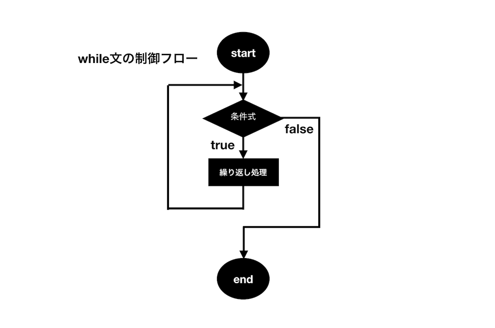
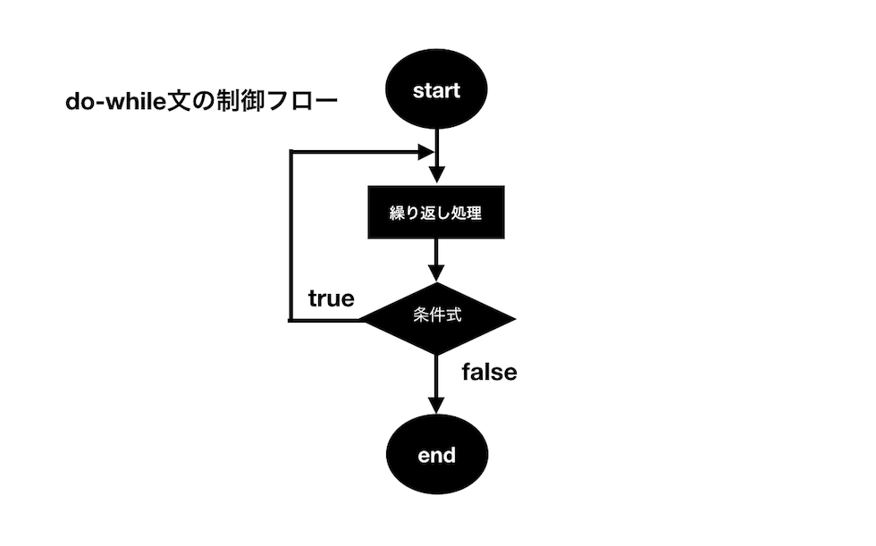

## while文

**_while文_**は**_if文_**のようなループの回数指定のない繰り返し処理に使われます。**_while文_**では、条件式が`true`の時ブロック内の繰り返し処理が実行され、その直後に再び条件式を判定します。そして条件式が`true`である限り、ブロック内の文が実行され続けます。

### while文の構文

**_while文_**の構文は次のようになります。

```js
while (条件式) {
  文；
  文;
  文;
}
```

実行したい文が一つの場合に限り以下のように書くこともできます。

```js
while (条件式) 文;
```

**_while文_**の制御フローをイメージにすると下の図のようになります。




- サンプルコード1

下記の例では、変数iが10以上になるまで繰り返し処理を実行しています。繰り返し処理の中で、変数iの値が**インクリメント**により1ずつ増え、10になった段階で次の条件式を満たさなくなるのでループは終了します。

```js
let i =0;

while (i < 10) {
  console.log(i); // 0から9までを表示
  i++;
}
```

出力結果：

```javascript
0
1
2
3
4
5
6
7
8
9
```

- サンプルコード2

この例では値が1000に達するまで、変数を2倍にする処理を繰り返しています。

```js
let number = 1;

while (number < 1000) {
  number *= 2; // number = number * 2 と同意
  console.log(number);
}
```

出力結果：

```js
2
4
8
16
32
64
128
256
512
1024
```

変数`number`が512となった後、次の条件式も`true`となるので`number`の値は処理文を経て1024になります。そして次の条件式の段階で条件式を満たさなくなるため、そこで繰り返し処理がスキップされます。どのタイミングが最後の繰り返し処理となるのかをしっかりと理解しておきましょう。

## while文のfor文への書き換え

**_while文_**と**_for文_**がお互いに書き換えが可能です。
先ほどのサンプルコード2の例を使って**_for文_**への書き換えを行うと次のようになります。

```js
for(let number = 1;number<1000;){
  number*=2;
  console.log(number);
}
```

上記の**_for文_**に変化式が記述されていないことに注目してください。
実は**_for文_**の()の中身はそれぞれ、省略して書くことができます。つまり`for(;;)`のような書き方もしようと思えばできてしまうのです(ただしこれは次に述べる無限ループになってしまいます)。いずれにせよ、上記の例のように繰り返し処理の最後に実行される変化式は省略して、**_while文_**の記述と同じようにすることで**_while文_**と同様の結果が得られます。ただし、このような書き方は不自然な感じがするので敢えてするものでもなく、やはり**_while文_**を使う方が自然です。繰り返し回数の指定がある場合は**_for文_**、ない場合は**_while文_**を使うと覚えておきましょう。

## 無限ループの有用性と危険性

式が偽(`false`)になることのない場合、これを**_無限ループ_**と言います。サーバなどでは常時運用が期待されるので時としてこういう処理も必要です。ですがその場合でもループの中で休憩する処理を入れるなど配慮が必要になります。いずれにしても意図しないプログラムを書いて無限ループになるのはコンピュータに負荷を与えてしまうので避けなければなりません。


## do-while文

**_do-while文_**は**_while文_**と同様に、条件式が真となる限りループを続けます。**_while文_**との違いは、まず繰り返し処理を先に実行し、条件式の評価がそのあとで行われることです。**_do-while文_**を使うことで条件式が`true`か`false`に関わらず、必ず一回は繰り返し処理を実行することができます。一般的に**_do-while_**を使う頻度は**_for文_**や**_while文_**に比べて少ないようですが、**_while文_**との違い、制御フローの特徴をしっかり理解しておきましょう。




### do-while文の構文

**_do-while文_**の構文は次のようになります。**_while文_**では条件式をブロックの先頭に記述していた一方で、**_do-while文_**では条件式を繰り返し処理のブロックの後に書きます。

```js
do {
  文;
  文;
} while (条件式);
```

以下の例で繰り返し処理が実行されるのは、**_do-while文_**側のみです。**_while文_**は条件を満たさないので処理が実行されることはありません。
```js
let i = 1;

while (i < 1) {
  console.log('while文を実行');
  i++;
}

let j = 1;

do {
  console.log('do-while文を実行');
  j++;
} while (j < 1)

```

出力結果：
```js
"do-while文を実行"
```